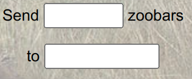
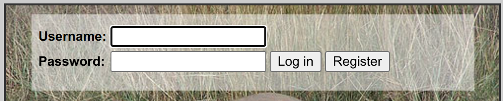

# Lab 2: Privilege separation and server-side sandboxing

This is the solution to [Lab2](http://css.csail.mit.edu/6.858/2022/labs/lab2.html) of [MIT 6.858 Spring 2022](http://css.csail.mit.edu/6.858/2022/). 

**!!!Important note for self-paced learners**: for any of you who try to work out the labs of Spring 2022 after July 2022, because Ubuntu 21.10 is no longer supported after July 2022 and the labs of Spring 2022 are deployed in Ubuntu 21.10, there are some fatal bugs in these labs and you need to follow the instructions below to fix the bugs in the labs.

## Fixing bugs in the labs

Because Ubuntu 21.10 (codenamed "impish") has come to its end in July 2022, any attempts to run 

```bash
sudo apt-get update
sudo apt-get install
```

in Ubuntu 21.10 will suffer from a fatal error of " 404 Error Not Found". Therefore, since both the virtual machines and containers of the labs are deployed in Ubuntu 21.10, trying to work out the labs after July 2022 without fixing the errors will not work. I consulted Prof. Nicolai Zeldovich about this, and since this class is not taught this fall, the 6.858 staff team will not fix the bugs right away. So that I tried to fix the bugs on my own, and fortunately, succeeded. The steps to fix the errors are as follows:

### Change /etc/apt/sources.list in the VM

Run the following commands:

   ```bash
   sudo chmod +rw /etc/apt/sources.list
   sudo vim /etc/apt/sources.list
   ```

When inside vim, press 'Esc' to enter the normal mode, and type the string inside the quotes: "%:s/mirrors.mit.edu/old-releases.ubuntu.com/g". This vim command replaces every mirros.mit.edu in this file to old-releases.ubuntu.com

### Fix bugs in container setup

Container setup is controlled by zookconf.py. And every command to be executed inside the container needs to use 'lxc.attach_run_command' api. The modification to zookconf.py is described below.

We only need to modify the configure_base() function.

```python

Class Container():
    ...
    def configure_base(self):
        # update path to include sbin so that apt install will work
        path = "/usr/local/bin:/usr/bin:/bin:/usr/local/games:/usr/games:/snap/bin:/usr/local/sbin:/sbin:/usr/sbin"
        ev = ["PATH=%s" % path]

        """codes added are shown below"""

        # the source file
        source_file = "/etc/apt/sources.list"
        # the back-up source file
        source_file_bkp = "/etc/apt/sources.list.bkp"

        # concatenate the /etc/apt/sources.list
        print("\nStart concatenating /etc/apt/sources.list")
        r=self.run_cmd(["cat", source_file])
        if r != 0:
            self.errormsg("Failed concatenating /etc/apt/sources.list")
            sys.exit(1)
        print("Concatenating /etc/apt/sources.list success.\n")

        # back up the source file
        print("Backing up the "+source_file+" to "+source_file_bkp)
        r=self.run_cmd(["cp", source_file, source_file_bkp])
        if r != 0:
            self.errormsg("Failed backing up "+source_file)
            sys.exit(1)
        print("Backing up "+source_file+" success.\n")

        # change the mode of the back-up file
        r=self.run_cmd(["chmod", "+rw", source_file])
        if r != 0:
            self.errormsg("Failed chmod "+source_file)
            sys.exit(1)

        # unsupported source url
        current_url = "http://archive.ubuntu.com/ubuntu"
        # old source url
        old_release_url = "http://old-releases.ubuntu.com/ubuntu/"
        # updating resources
        r = self.run_cmd(["sh", "-c", "echo '# changing sources to old-releases' > "+source_file])
        if r!=0:
                self.errormsg("Failed updating "+source_file)
                sys.exit(1)
        echo_lines=["deb "+old_release_url+" impish main restricted universe multiverse",
                    "deb "+old_release_url+" impish-updates main restricted universe multiverse",
                    "deb "+old_release_url+" impish-security main restricted universe multiverse"]
        for line in echo_lines:
            r=self.run_cmd(["sh","-c","echo "+line+" >> "+source_file])
            if r!=0:
                self.errormsg("Failed updating "+source_file)
                sys.exit(1)

        # install packages for zoobar
        # terminate early if anything goes wrong here
        r = self.run_cmd(["apt-get", "update"], extra_env_vars=ev)
        if r != 0:
            self.errormsg("Failed updating apt package info")
            sys.exit(1)
        # need to install following packages
        r = self.run_cmd(["apt-get", "install", "-y", "software-properties-common"])
        if r != 0:
            self.errormsg("Failed apt-get software-properties-common")
            sys.exit(1)
        r = self.run_cmd(["add-apt-repository","universe"])
        if r != 0:
            self.errormsg("Failed add-apt-repository universe")
            sys.exit(1)

        """ end of added codes """

        r = self.run_cmd(["apt-get", "install", "-y"] + pkgs, extra_env_vars=ev)
        if r != 0:
            self.errormsg("Failed installing packages")
            sys.exit(1)
        ...
    pass
...
```
### Check the fixes
After fixing the bugs, run

```bash
cd lab
./zookld.py
```

Everything will work fine, though it may download many useless package and takes a while longer to get the containers ready.

## Exercise 1

Description:

```
Read through the code of zoobar and see how transfer.py gets invoked when a user sends a transfer on the transfer page. 
```

We register two accounts: user1 and user2, both with the password of 12345 .First, we start with the templates/transfer.html file. Its code is shown below:

```html

Transfer

<b>Balance: </b><span id="myZoobars"></span> zoobars<br />
<form method="POST" name="transferform" action="{{ url_for('transfer') }}">
<p>Send <input name="zoobars" type="text" value="{{ request.form.get('zoobars', '') }}" size=5> zoobars</p>
<p>to <input name=recipient type=text value="{{ request.form.get('recipient', '') }}" size=10></p>
<input type="submit" name="submission" value="Send">
</form>

<span class="warning">{{ warning }}</span>

<script type="text/javascript" src="{{ url_for('zoobarjs') }}"></script>

```

This html file makes up the 'Transfer' section in the zoobar website.

```html
<b>Balance: </b><span id="myZoobars"></span> zoobars<br />
```

This line of html code corresponds to the zoobars contained by the user, as shown below


And the next 'form' body, as shown below

```html
<form method="POST" name="transferform" action="{{ url_for('transfer') }}">
<p>Send <input name="zoobars" type="text" value="{{ request.form.get('zoobars', '') }}" size=5> zoobars</p>
<p>to <input name=recipient type=text value="{{ request.form.get('recipient', '') }}" size=10></p>
<input type="submit" name="submission" value="Send">
</form>
```

describes the variables to store the input from a textline and the methods to use, as shown below:




```html
<input name="zoobars" ...>
<input name=recipient ...>
```

This code stores the number of sent zoobars to the variable named "zoobars". And the variable 'recipient' stores the receiver of the sent zoobars.

```html
<input ... value="{{ request.form.get('zoobars', '') }}" >
<input ... value="{{ request.form.get('recipient', '') }}">
```

This code describes how the variables 'zoobars' and 'recipient' get their values.

Now, we have gotten a overview of what the transfer.html code does, and how our actions (clicks of the mouse) invokes the buttons and send the value to its stored variable. Next thing we need to do is checking the initialization python file to find out how the zoobar application is initialized.

The \_\_init\_\_.py file is pretty simple. It constructs an application based on the [Flask framework](https://flask.palletsprojects.com/en/2.2.x/). Its code is shown below:

```python
#!/usr/bin/env python3

# For relative imports to work in Python 3.6
import os, sys
sys.path.append(os.path.dirname(os.path.realpath(__file__)))

from flask import Flask, g

import login
import index
import users
import transfer
import echo
import zoobarjs
import zoodb
from debug import catch_err

app = Flask(__name__)

app.add_url_rule("/", "index", index.index, methods=['GET', 'POST'])
app.add_url_rule("/users", "users", users.users)
app.add_url_rule("/transfer", "transfer", transfer.transfer, methods=['GET', 'POST'])
app.add_url_rule("/zoobarjs", "zoobarjs", zoobarjs.zoobarjs, methods=['GET'])
app.add_url_rule("/login", "login", login.login, methods=['GET', 'POST'])
app.add_url_rule("/logout", "logout", login.logout)
app.add_url_rule("/echo", "echo", echo.echo)

@app.after_request
@catch_err
def disable_xss_protection(response):
    response.headers.add("X-XSS-Protection", "0")
    return response

if __name__ == "__main__":
    app.run()

```

This line of code

```python
app = Flask(__name__)
```

is a conventional way to initialize a object (i.e., construct an application) based on Flask. Therefore, we get an object named 'app', which we will be mainly working on.

```python
app.add_url_rule("/", "index", index.index, methods=['GET', 'POST'])
...
app.add_url_rule("/transfer", "transfer", transfer.transfer, methods=['GET', 'POST'])
...
```

These 'add_url_rule' codes defines how and where the urls are looked up in zoobar. We refer to the [Flask document of add_url_rule method](https://flask.palletsprojects.com/en/2.2.x/api/), this function is defined below

```python
add_url_rule(rule, endpoint=None, view_func=None,provide_automatic_options=None, **options)
```

* The rule parameter is the rule registered for routing incoming requests and building URLs.

* The endpoint is the name for the route defaults to the name of the view function if the endpoint parameter isn’t passed.

* The methods parameter defaults to ["GET"]. HEAD is always added automatically, and OPTIONS is added automatically by default.

* The view_func does not necessarily need to be passed, but if the rule should participate in routing an endpoint name must be associated with a view function at some point with the endpoint() decorator.

Therefore, let's look at the add_url_rule function associated with transfer.

```python
app.add_url_rule("/transfer", "transfer", transfer.transfer, methods=['GET', 'POST'])
```

This code defines where to look at the '/transfer' url and how this url is view (i.e., using transfer.transfer function). Thus, the next thing we do is to check the transfer.transfer function.

The transfer.py file looks as below:

```python
from login import requirelogin
from zoodb import *
from debug import *
import bank
import traceback

from flask import g, render_template, request

@catch_err
@requirelogin
def transfer():
    warning = None
    try:
        if 'recipient' in request.form:
            zoobars = eval(request.form['zoobars'])
            bank.transfer(g.user.person.username,
                          request.form['recipient'], zoobars)
            warning = "Sent %d zoobars" % zoobars
    except (KeyError, ValueError, AttributeError) as e:
        traceback.print_exc()
        warning = "Transfer to %s failed" % request.form['recipient']

    return render_template('transfer.html', warning=warning)
```

Aha! It is pretty easy to see what this function does. It retrieves the 'recipient' variable from request.form, which is used in the /templates/transfer.html file as described above, collects the number of sent zoobars and use the number in 'bank.transfer' function.

```python
zoobars = eval(request.form['zoobars'])
bank.transfer(g.user.person.username,
            request.form['recipient'], zoobars)
```

The 'eval' function gets the number of zoobars and use it in the bank.transfer.

Next we examine the 'bank.transfer' function. It is defined in 'bank.py' file.

```python
def transfer(sender, recipient, zoobars):
    ...
    pass
```

As we can tell from its parameter, the 'bank.transfer' fucntion takes the sender, the recipient and zoobars as its parameters, sending $zoobars zoobars from 'sender' to recipient. Therefore

```python
bank.transfer(g.user.person.username,
            request.form['recipient'], zoobars)
```

sends zoobars from the sender to recipient.

Whoa! Now we have get the whole picture of the transfer process, which is

* the /templates/transfer.html stores the variables from the user input, such as the 'recipient'
* the \__init\_\_.py defines the rules of routing incoming urls and its viewing functions. These rules can also be used to explain all the outputs in Shell shown in the beginning if we look at other 'add_url_rules' functions.
* the transfer.transfer function gets the number of zoobars and uses bank.transfer to send the zoobars.

Let's move on to the next part.

## Exercise 2 and Exercise 3

Bothe exercise 2 and exercise 3 are rather easy, but you should be careful when doing the two exercises because some parts are pretty tricky and may cause a lot of time if not careful enough.

Exercise 2 description:

```
Modify zook.conf to replace zookfs with two separate services, dynamic and static. Both should use cmd = zookfs.

dynamic should execute just /zoobar/index.cgi (which runs all the Python scripts), but should not serve any static files. static should serve static files but not execute anything.
```

Exercise 3 description:

```
Write appropriate fwrule entries for main, static, and dynamic to limit the communication as specified above.
```

To create two more containers to execute dynamic and static respectively, we just need to modify some parts of zook.conf. And to write the fwrule entries for main, static and dynamic, just refer to the comments in the original \[zookfs\] part, it is easy. 

The file should look as follows:

```apacheconf
[main]
    cmd = zookd2
    dir = /home/student/
    lxcbr = 0
    port = 8080
    http_svcs = dynamic,static

[echo]
    cmd = /zoobar/echo-server.py
    dir = /home/student
    lxcbr = 9
    port = 8081

[dynamic]
    cmd = zookfs
    url = /zoobar/index.cgi.*
    dir = /home/student/
    lxcbr = 2
    port = 8081
    fwrule = -s main -j ACCEPT
    fwrule = -j REJECT

[static]
    cmd = zookfs
    url = /zoobar/(media|templates).*|/favicon.ico|/index\.html
    dir = /home/student/
    lxcbr = 3
    port = 8081
    fwrule = -s main -j ACCEPT
    fwrule = -j REJECT
```

**!!NOTE:** it is important that the names of the two containers which serve dynamic and static services should strictly be "dynamic" and "static", otherwise it may not pass the lab check. 

See check_lab2.py for detail:

```python
def check_ex2():
    check_run(["dynamic", "static"])
    c = lxc.Container('zookfs')
    if c.running:
        fail_exit("Container zookfs shouldn't be running")
    if check_nodb("static") and check_dbexists("dynamic", "person"):
        ok("Exercise 2: separation")
```

As we can tell from check_ex2(), this check specifies the names of the containers as "dynamic" and "static". Therefore, the names of the zook.conf should be consistent with these specified names.

Aha, we run

```bash
~/lab$ ./zookclean.py
~/lab$ ./zookstop.py
~/lab$ ./zookld.py
~/lab$ make check
```

we will get

```bash
PASS: App functionality
PASS: Exercise 2: separation
PASS: Exercise 3: fwrule
```

we can move on to the next part.

## Exercise 4

Description:

```
1. Decide what interface your authentication service should provide (i.e., what functions it will run for clients).

2. Create a new auth service for user authentication, along the lines of echo-server.py. 

3. Modify zook.conf to start the auth-server appropriately (in a container on a different virtual network).

4. Split the user credentials (i.e., passwords and tokens) from the Person database into a separate Cred database, stored in /zoobar/db/cred. Don't keep any passwords or tokens in the old Person database.

5. Modify the login code in login.py to invoke your auth service instead of calling auth.py directly.

6. Implement privilege separation for user authentication, as described above.
```

We solve these tasks one after another.

**Important Note!!**: when doing this part of the lab, you should be very clear about what to do next and strictly follow the order of tasks assigned to you. Otherwise it would cost you a lot of extra time.

### Task 1: Decide what interface your authentication service should provide

To get a clear picture of what to separate in different containers, we should at first get a whole idea of how the login part works.

In /zoobar/\_\_init\_\_.py, 

```python
app.add_url_rule("/login", "login", login.login, methods=['GET', 'POST'])
```

invokes login.login() when the user tries to reach the url "/index.cgi/login", and login.login() handles all the requests issued in this url.

In /zoobar/login.py,

```python
def login():
    ...
    user = User()
    ...
```

the login.login() first creates a 'user' object with 'User()', which includes many methods to be used hereafter.
```python
def login():
    ...
    if 'submit_registration' in request.form:
        ...
        else:
            cookie = user.addRegistration(username, password)
        ...
    elif 'submit_login' in request.form:
        ...
        else:
            cookie = user.checkLogin(username, password)
        ...
```

defines two user behaviors in "/index.cgi/login", which are 'submit_registration' for register button and 'submit_login' for log in button, as shown below.



When the user hits the register button (in the first 'if' codeblock), the login.login() invokes the 'user.addRegistration' function, a built-in function of Class User. Its code is shown below:

```python
class User(object):
    def addRegistration(self, username, password):
        token = auth.register(username, password)
        if token is not None:
            return self.loginCookie(username, token)
        else:
            return None
```

addRegistration() calls auth.register() to register a user with user name and its password. Thus, it is important to see how auth.register() handles registration.

In /zoobar/auth.py,

```python
def register(username, password):
    db = person_setup()
    person = db.query(Person).get(username)
    if person:
        return None
    newperson = Person()
    newperson.username = username
    newperson.password = password
    db.add(newperson)
    db.commit()
    return newtoken(db, newperson)
```

as we can tell from this code, auth.register() adds a person into a "person" data base if the user name is new, and returns the token from this user.

And look back to addRegistration() in /zoobar/login.py, now it gets the token from auth.register(), then if the token actually exists, addRegistration() calls self.loginCookie(), as shown below.

/zoobar/login.py:

```python
class User(object):
    def addRegistration(self, username, password):
        token = auth.register(username, password)
        if token is not None:
            return self.loginCookie(username, token)
        ...
```

Whoo..Now we have almost gotten how register a user is handled.

1. login.login() calls addRegistration(), which later calss auth.register()
2. auth.register() adds a new user into a "person" data base if the user did not exist before, and returns a token.
3. addRegistration() gets the token and calls the loginCookie().

Quite an accomplishment! Let's forget about the loginCookie() for one second (because we will return to it very soon), and look at how logging in is handled.

As in /zoobar/login.py,

/zoobar/login.py:

```python
def login():
    ...
    elif 'submit_login' in request.form:
        ...
        else:
            cookie = user.checkLogin(username, password)
```

the "elif" code block handles the logging in behavior, which calls the checkLogin() function.

/zoobar/login.py:

```python
class User(object):
    def checkLogin(self, username, password):
        token = auth.login(username, password)
        if token is not None:
            return self.loginCookie(username, token)
        else:
            return None
```

Similar to that in handling register, checkLogin() also calls a method from module auth, i.e., auth.login().

/zoobar/auth.py:

```python
def login(username, password):
    db = person_setup()
    person = db.query(Person).get(username)
    if not person:
        return None
    if person.password == password:
        return newtoken(db, person)
    else:
        return None
```

This auth.login() function is nearly the same as auth.register()! Except that auth.login() contains a extra password check. They both need the "person" data base to enable checks and etc.

And after auth.login() returns a token, the checkLogin() also calls the loginCookie() if the token exists. Aha, we see two things keep running up in handling registration and loggin in: loginCookie() function and a "person" data base.

The loginCookie() calls the setPerson() function:

/zoobar/login.py:

```python
class User(object):
    def loginCookie(self, username, token):
        self.setPerson(username, token)
        return "%s#%s" % (username, token)

    def setPerson(self, username, token):
        persondb = person_setup()
        self.person = persondb.query(Person).get(username)
        self.token = token
        self.zoobars = bank.balance(username)
```

setPerson() also queries the "person" data base to get running.

As defined in /zoobar/zoodb.py,

/zoobar/zoodb.py;

```python
class Person(PersonBase):
    __tablename__ = "person"
    username = Column(String(128), primary_key=True)
    password = Column(String(128))
    token = Column(String(128))
    zoobars = Column(Integer, nullable=False, default=10)
    profile = Column(String(5000), nullable=False, default="")
```

defines a Person class, which contains all the information of the user, including credentials like passwords and tokens. And the following codes set up the "person" data base:

/zoobar/zoodb.py:

```python
PersonBase = declarative_base()
def dbsetup(name,base):
    ...
def person_setup():
    return dbsetup("person", PersonBase)
```

Right now, we have run through the whole process of handling url "/zoobar/index.cgi/login", which really helps doing the rest of this lab. 

**An important thing** in designing our separation of services is that all the things run locally, including the "person" data base which contains all credential information. And given our knowledge of RPC process, handling login or register locally is not secure and should be separated.

**Therefore, our design should be like**:

1. separate the data base from the main container, i.e., set the data base in a different container.
2. to achieve the separation of data base, there must be a server in the data base container to check the data base for user information.
3. therefore, we use the RPC model. One container as the client sends the requests, and the other container includes a server that handles the requests, checks the database and forwards the result back to the client.
4. also, the "person" data base contains too much information, we need to separate the credentials from the "person" data base. Thus, the "person" data base contains regular information locally, and the "cred" data base contains credentials in a different container (i.e., the server container).

Given our design goals, we solve the following tasks.

### Task 2: Create a new auth service for user authentication, along the lines of echo-server.py.

In solving this task, we need to follow the example in /zoobar/echo.py and /zoobar/echo-server.py to write appropriate RPC codes. This is a easy task, codes are shown below (IF YOU DO NOT UNDERSTAND, READ THE ECHO/ECHO-SERVER.PY CODE!!!!)

/zoobar/auth_client.py:

```python
from debug import *
from zoodb import *
import rpclib

sys.path.append(os.getcwd())
import readconf

def login(username, password):
    ## Fill in code here.
    host = readconf.read_conf().lookup_host('auth')
    kwargs = {"username":username, "password":password}
    with rpclib.client_connect(host) as c:
        return c.call('login', **kwargs)

def register(username, password):
    ## Fill in code here.
    host = readconf.read_conf().lookup_host('auth')
    kwargs = {"username":username, "password":password}
    with rpclib.client_connect(host) as c:
        return c.call('register', **kwargs)

def check_token(username, token):
    ## Fill in code here.
    host = readconf.read_conf().lookup_host('auth')
    kwargs = {"username":username, "token":token}
    with rpclib.client_connect(host) as c:
        return c.call('check_token', **kwargs)
```

/zoobar/auth-server.py:

```python
#!/usr/bin/env python3
import rpclib
import sys
import auth
from debug import *
from zoobar.zoodb import person_setup

class AuthRpcServer(rpclib.RpcServer):
    ## Fill in RPC methods here.
    def rpc_login(self, username, password):
        return auth.login(username, password)

    def rpc_register(self, username, password):
        return auth.register(username, password)
    
    def rpc_check_token(self, username, token):
        return auth.check_token(username, token) 

if len(sys.argv) != 2:
    print(sys.argv[0], "too few args")

s = AuthRpcServer()
s.run_fork(sys.argv[1])
```

**Important note here**: the names of all methods defined in any class, which inherits from rpclib.RpcServer, should start with 'rpc_'. Otherwise the methods will not be called properly. See the following code for detail.

/zoobar/rpclib.py:

```python
class RpcServer(object):
    def run_sock(self, sock):
        ...
            m = self.__getattribute__('rpc_' + method)
            ret = m(**kwargs)
        ...
```

### Task 3: Modify zook.conf to start the auth-server appropriately (in a container on a different virtual network).

This is also a easy one. Just **remember** to add a fwrule to the dynamic container, which should accept ip packets from the auth container.

```apacheconf
[dynamic]
    cmd = zookfs
    url = /zoobar/index.cgi.*
    dir = /home/student/
    lxcbr = 2
    port = 8081
    fwrule = -s main -j ACCEPT
    fwrule = -s echo -j ACCEPT
    fwrule = -s auth -j ACCEPT
    fwrule = -j REJECT
[auth]
    cmd = /zoobar/auth-server.py
    dir = /home/student
    lxcbr = 4
    port = 8081
...
```

### Task 4: Split the user credentials (i.e., passwords and tokens) from the Person database into a separate Cred database, stored in /zoobar/db/cred. Don't keep any passwords or tokens in the old Person database.

First, create a Cred database in /zoobar/zoodb.py. Just follow the examples of "person" database and "transfer" database. And we should remove passwords and tokens from Person().

/zoobar/zoodb.py:

```python
CredBase = declarative_base()

class Cred(CredBase):
    __tablename__ = "cred"
    username = Column(String(128), primary_key=True)
    password = Column(String(128))
    token = Column(String(128))

class Person(PersonBase):
    __tablename__ = "person"
    username = Column(String(128), primary_key=True)
    # password = Column(String(128))
    # token = Column(String(128))
    zoobars = Column(Integer, nullable=False, default=10)
    profile = Column(String(5000), nullable=False, default="")

def cred_setup():
    return dbsetup("cred", CredBase)

```

**Remember!!!** The Cred database resides in the auth container, therefore the codes in /zoobar/auth.py should also be modified (because the original version is based on the Person database). 

/zoobar/auth.py:

```python
...
def login(username, password):
    # db = person_setup()
    # person = db.query(Person).get(username)
    # if not person:
    #     return None
    # if person.password == password:
    #     return newtoken(db, person)
    # else:
    #     return None
    cred_db = cred_setup()
    cred = cred_db.query(Cred).get(username)
    if not cred:
        return None
    if cred.password == password:
        return newtoken(cred_db, cred)
    else:
        return None

def register(username, password):
    # db = person_setup()
    # person = db.query(Person).get(username)
    # if person:
    #     return None
    # newperson = Person()
    # newperson.username = username
    # newperson.password = password
    # db.add(newperson)
    # db.commit()
    # return newtoken(db, newperson)
    cred_db = cred_setup()
    cred = cred_db.query(Cred).get(username)
    if cred:
        return None
    newcred = Cred()
    newcred.username = username
    newcred.password = password
    cred_db.add(newcred)
    cred_db.commit()
    return newtoken(cred_db, newcred)


def check_token(username, token):
    # db = person_setup()
    # person = db.query(Person).get(username)
    # if person and person.token == token:
    #     return True
    # else:
    #     return False
    cred_db = cred_setup()
    cred = cred_db.query(Cred).get(username)
    if cred and cred.token == token:
        return True
    else:
        return False
```

### Task 5: Modify the login code in login.py to invoke your auth service instead of calling auth.py directly.

This task is a little tricky. The first step is to replace all the original calling to auth.py with calling to auth_client.py.

```python
def checkLogin(self, username, password):
    # token = auth.login(username, password)
    token = auth_client.login(username, password)
    if token is not None:
        return self.loginCookie(username, token)
    else:
        return None
def addRegistration(self, username, password):
    # token = auth.register(username, password)
    token = auth_client.register(username, password)
    if token is not None:
        return self.loginCookie(username, token)
    else:
        return None
def checkCookie(self, cookie):
    if cookie is None:
        return
    (username, token) = cookie.rsplit("#", 1)
    # if auth.check_token(username, token):
    if auth_client.check_token(username, token):
        self.setPerson(username, token)
```

The next step is pretty tricky. It caused me some time to solve this task.

Remember the setPerson() function, it used to look like this:

/zoobar/login.py (old):

```python
def setPerson(self, username, token):
    persondb = person_setup()
    self.person = persondb.query(Person).get(username)
    self.token = token
    self.zoobars = bank.balance(username)
```

It seems fine at first. But if you think carefully, we have already changed the Person data base, and also all the database that were queried and changed reside in the auth container!! It means that when we run the setPerson() locally, there are not any databases to query because either the databse has been changed (Person -> Person and Cred) or the database resides in a different container (i.e., the server container). Therefore, some changes are also needed here.

/zoobar/login.py (now):

```python
def setPerson(self, username, token):
    # persondb = person_setup()
    # self.person = persondb.query(Person).get(username)
    # self.token = token
    # self.zoobars = bank.balance(username)
    persondb = person_setup()
    person = persondb.query(Person).get(username)
    if person is None:
        person = Person()
        person.username = username
        persondb.add(person)
        persondb.commit()
    self.person = person
    self.token = token
    self.zoobars = bank.balance(username)
```

### Task 6: Implement privilege separation for user authentication, as described above.

Wrapping all these together, we have achieved our goals. Let's check whether it passes:

```bash
~lab$ make check
PASS: Exercise 4: separation
```

Yep! We have passed the test!!

## Exercise 5

Description:

```
Specify the appropriate fwrule entries for auth.
```

This is easy. auth should not accept any entries except from the dynamic.

/zook.conf:

```apacheconf
[auth]
    cmd = /zoobar/auth-server.py
    dir = /home/student
    lxcbr = 4
    port = 8081
    fwrule = -s dynamic -j ACCEPT
    fwrule = -j REJECT
```

## Exercise 6

Description:

```
Implement password hashing and salting in your authentication service. In particular, you will need to extend your Cred table to include a salt column; modify the registration code to choose a random salt, and to store a hash of the password together with the salt, instead of the password itself; and modify the login code to hash the supplied password together with the stored salt, and compare it with the stored hash. Don't remove the password column from the Cred table (the check for exercise 5 requires that it be present); you can store the hashed password in the existing password column.
```

This exercise is also fairly easy. Just follow the steps described above, and note that you should only use the 'os.urandom()' function to create the random salt. 

The solution to this exercise takes three steps:

1. add a salt column to Cred database

    /zoobar/zoodb.py:

    ```python
    class Cred(CredBase):
        __tablename__ = "cred"
        username = Column(String(128), primary_key=True)
        password = Column(String(128))
        salt = Column(String(128))
        token = Column(String(128))
    ```

2. modify the auth.register() function so that it registers the user along with the salt and the hashed password

    /zoobar/auth.py:

    ```python
    def register(username, password):
        cred_db = cred_setup()
        cred = cred_db.query(Cred).get(username)
        if cred:
            return None
        
        ## creating salt
        salt = os.urandom(128)
        ## Set up credential data base
        newcred = Cred()
        newcred.username = username
        newcred.salt = salt
        ## add hashed password
        newcred.password = pbkdf2.PBKDF2(password, newcred.salt).hexread(32)
        cred_db.add(newcred)
        cred_db.commit()
        return newtoken(cred_db, newcred)
    ```

3. modify the auth.login() function so that it checks the hashed password for loggin in.

    /zoobar/auth.py:

    ```python
    def login(username, password):
        cred_db = cred_setup()
        cred = cred_db.query(Cred).get(username)
        if not cred:
            return None
        
        salt = cred.salt
        hash_password = pbkdf2.PBKDF2(password, salt).hexread(32)
        # if cred.password == password:
        if cred.password == hash_password:
            return newtoken(cred_db, cred)
        else:
            return None
    ```

And run the test, we will pass exercise 6.

## Exercise 7

Description:

```
Privilege-separate the bank logic into a separate bank service, along the lines of the authentication service. Your service should implement the transfer and balance functions, which are currently implemented by bank.py and called from several places in the rest of the application code.
```

This is similar to what we have done in Exercise 4. We need to separate zoobars from the Person database and place them in the Bank database. And a bank service should be running in a different container, which also contains the Bank database. Therefore, the steps are as follows:

1. create a Bank database in /zoobar/zoodb.py

    /zoobar/zoodb.py:

    ```python
    BankBase = declarative_base()
    class Bank(BankBase):
        __tablename__ = "bank"
        username = Column(String(128), primary_key=True)
        zoobars = Column(Integer, nullable=False, default=10)

    class Person(PersonBase):
        __tablename__ = "person"
        username = Column(String(128), primary_key=True)
        # zoobars = Column(Integer, nullable=False, default=10)
        profile = Column(String(5000), nullable=False, default="")

    def bank_setup():
        return dbsetup("bank", BankBase)

    ```
2. create a RPC model, meaning that we have a bank-server.py and bank.py (I am just lazy to create a new bank-client.py, so I just modify codes inside the bank.py)

    /zoobar/bank-server.py:
    ```python
    #!/usr/bin/env python3
    #
    # Insert bank server code here.
    #

    import rpclib
    import sys
    from debug import *
    import zoobar
    from zoodb import *

    class BankRpcServer(rpclib.RpcServer):
        def rpc_transfer(self, sender, recipient, zoobars):
            bank_db = bank_setup()
            sender_bank = bank_db.query(Bank).get(sender)
            recipient_bank = bank_db.query(Bank).get(recipient)

            sender_balance = sender_bank.zoobars-zoobars
            recipient_balance = recipient_bank.zoobars+zoobars

            if sender_balance < 0 or recipient_balance < 0:
                return "ValueError"
            
            sender_bank.zoobars = sender_balance
            recipient_bank.zoobars = recipient_balance
            bank_db.commit()
            return "OK"

        
        def rpc_balance(self, username):
            bank_db = bank_setup()
            bank = bank_db.query(Bank).get(username)
            if bank is None:
                bank = Bank()
                bank.username = username
                bank_db.add(bank)
                bank_db.commit()
            return bank.zoobars

    if len(sys.argv) != 2:
        print(sys.argv[0], "too few args")

    s = BankRpcServer()
    s.run_fork(sys.argv[1])
    ```

    /zoobar/bank.py:

    ```python
    from zoodb import *
    from debug import *
    import time
    import rpclib
    sys.path.append(os.getcwd())
    import readconf
    def transfer(sender, recipient, zoobars):
        # persondb = person_setup()
        # senderp = persondb.query(Person).get(sender)
        # recipientp = persondb.query(Person).get(recipient)

        # sender_balance = senderp.zoobars - zoobars
        # recipient_balance = recipientp.zoobars + zoobars

        # if sender_balance < 0 or recipient_balance < 0:
        #     raise ValueError()

        # senderp.zoobars = sender_balance
        # recipientp.zoobars = recipient_balance
        # persondb.commit()

        host = readconf.read_conf().lookup_host('bank')
        kwargs = {"sender":sender, "recipient": recipient, "zoobars":zoobars}
        with rpclib.client_connect(host) as c:
            ret = c.call('transfer', **kwargs)
            if ret == "ValueError":
                raise ValueError()
        
        transfer = Transfer()
        transfer.sender = sender
        transfer.recipient = recipient
        transfer.amount = zoobars
        transfer.time = time.asctime()

        transferdb = transfer_setup()
        transferdb.add(transfer)
        transferdb.commit()

    def balance(username):
        # db = person_setup()
        # person = db.query(Person).get(username)
        # return person.zoobars
        host = readconf.read_conf().lookup_host('bank')
        kwargs = {"username":username}
        with rpclib.client_connect(host) as c:
            return c.call('balance', **kwargs)
    ```
3. create a bank server container

    /zook.conf:

    ```apacheconf
    [dynamic]
    cmd = zookfs
    url = /zoobar/index.cgi.*
    dir = /home/student/
    lxcbr = 2
    port = 8081
    fwrule = -s main -j ACCEPT
    fwrule = -s echo -j ACCEPT
    fwrule = -s auth -j ACCEPT
    fwrule = -s bank -j ACCEPT
    fwrule = -j REJECT

    [bank]
    cmd = /zoobar/bank-server.py
    dir = /home/student
    lxcbr = 5
    port = 8081
    ```

Run the test, everything will be fine.

## Exercise 8

Description:

```
Add authentication to the transfer RPC in the bank service. The current user's token is accessible as g.user.token. 
```

This one is also fairly easy. To authenticate the caller, we need to query the auth service. Therefore, we just need to add a query to auth service to the client, or the server, whichever is fine. I choose to add to the client (i.e., the bank.py).

The codes are as follow:

/zoobar/bank.py:

```python
def transfer(sender, recipient, zoobars, token):
    host = readconf.read_conf().lookup_host('auth')
    kwargs = {"username":sender, "token":token}
    with rpclib.client_connect(host) as c:
        ret = c.call('check_token', **kwargs)
        if not ret:
            raise ValueError()

    host = readconf.read_conf().lookup_host('bank')
    kwargs = {"sender":sender, "recipient": recipient, "zoobars":zoobars}
    with rpclib.client_connect(host) as c:
        ret = c.call('transfer', **kwargs)
        if ret == "ValueError":
            raise ValueError()
    ...
```

And don't forget to modify the calling to bank.transfer()!! It is in /zoobar/transfer.py.

```python
def transfer():
    ...
    bank.transfer(g.user.person.username,
        request.form['recipient'], zoobars, g.user.token)
```

## Exercise 9

Description:

```
Specify the appropriate fwrule entries for the bank service.
```

Fairly easy. If you choose to add authentication in the client, then the bank server should only accepts packets from the dynamic service.

/zook.conf

```apacheconf
[bank]
    cmd = /zoobar/bank-server.py
    dir = /home/student
    lxcbr = 5
    port = 8081
    fwrule = -s dynamic -j ACCEPT
    fwrule = -j REJECT
```

## Exercise 10

**Important Note here**!!! You must create a bank_client.py service, since it is needed in the rest of the lab. Don't be lazy as I did!! Creating a bank client is easy. I won't go into details here, just list the codes.

/zoobar/bank_client.py:

```python
from flask import g, render_template, request
from debug import *
import os
import rpclib
import sys
import readconf

def transfer(sender, recipient, zoobars, token=None):
    host = readconf.read_conf().lookup_host('bank')
    kwargs = {"sender":sender, "recipient": recipient, "zoobars":zoobars, "token":token}
    with rpclib.client_connect(host) as c:
        ret = c.call('transfer', **kwargs)
        if ret == "ValueError":
            raise ValueError()

def balance(username):
    host = readconf.read_conf().lookup_host('bank')
    kwargs = {"username":username}
    with rpclib.client_connect(host) as c:
        return c.call('balance', **kwargs)

def get_log(username):
    host = readconf.read_conf().lookup_host('bank')
    kwargs = {"username":username}
    with rpclib.client_connect(host) as c:
        return c.call('get_log', **kwargs)
``` 

/zoobar/bank-server.py:

```python
#!/usr/bin/env python3
#
# Insert bank server code here.
#
import rpclib
import sys
from debug import *
import zoobar
from zoodb import *
import bank
import readconf
class BankRpcServer(rpclib.RpcServer):
    def rpc_transfer(self, sender, recipient, zoobars, token):
        host = readconf.read_conf().lookup_host('auth')
        kwargs = {"username":sender, "token":token}
        with rpclib.client_connect(host) as c:
            ret = c.call('check_token', **kwargs)
            if not ret:
                return "ValueError"
            bank.transfer(sender, recipient, zoobars)
            return "OK"


    
    def rpc_balance(self, username):
        bank_db = bank_setup()
        bank = bank_db.query(Bank).get(username)
        if bank is None:
            bank = Bank()
            bank.username = username
            bank_db.add(bank)
            bank_db.commit()
        return bank.zoobars
    
    def rpc_get_log(self, username):
        return bank.get_log(username)

if len(sys.argv) != 2:
    print(sys.argv[0], "too few args")

s = BankRpcServer()
s.run_fork(sys.argv[1])
```

And we just need to turn the /zoobar/bank.py to its original version.

Next let's get started with Exercise 10:

Description:

```
Add profile-server.py to your web server.

Make sure that your Zoobar site can support all of the five profiles.
```

The first step is to modify the zook.conf, add the profile service and the corresponding firewall rules.

/zook.conf:

```apacheconf
[dynamic]
    cmd = zookfs
    url = /zoobar/index.cgi.*
    dir = /home/student/
    lxcbr = 2
    port = 8081
    fwrule = -s main -j ACCEPT
    fwrule = -s echo -j ACCEPT
    fwrule = -s auth -j ACCEPT
    fwrule = -s bank -j ACCEPT
    fwrule = -s profile -j ACCEPT
    fwrule = -j REJECT
...
[bank]
    cmd = /zoobar/bank-server.py
    dir = /home/student
    lxcbr = 5
    port = 8081
    fwrule = -s profile -j ACCEPT
    fwrule = -s auth -j ACCEPT
    fwrule = -s dynamic -j ACCEPT
    fwrule = -j REJECT

[profile]
    cmd = /zoobar/profile-server.py
    dir = /home/student
    lxcbr = 6
    port = 8081
    fwrule = -s bank -j ACCEPT
    fwrule = -s dynamic -j ACCEPT
    fwrule = -j REJECT
```

Notice that the firewall rules of profile should accept ip packets from bank service but not the auth service, according to the specification of the lab.

Moreover, since that the xfer service of profile calls the transfer() function without the token parameter, we need to modify our transfer() functions in both the bank server and the client so that they adapt to the missing 'token' parameter. And we also need to add a 'get_token()' function to both the auth.py and the auth-server.py

/zoobar/bank-server.py:

```python
class BankRpcServer(rpclib.RpcServer):
    def rpc_transfer(self, sender, recipient, zoobars,token = None):
        if token == None:
            if self.caller == 'profile':
                host = readconf.read_conf().lookup_host('auth')
                kwargs = {"username":sender}
                with rpclib.client_connect(host) as c:
                    token = c.call('get_token', **kwargs)
            else:
                return "ValueError"
        host = readconf.read_conf().lookup_host('auth')
        kwargs = {"username":sender, "token":token}
        with rpclib.client_connect(host) as c:
            ret = c.call('check_token', **kwargs)
            if not ret:
                return "ValueError"
            bank.transfer(sender, recipient, zoobars)
            return "OK"
```

/zoobar/bank_client.py:

```python
def transfer(sender, recipient, zoobars, token=None):
    ...
```

/zoobar/auth.py:

```python
def get_token(username):
    cred_db = cred_setup()
    cred = cred_db.query(Cred).get(username)
    return cred.token
```

/zoobar/auth-server.py:

```python
class AuthRpcServer(rpclib.RpcServer):
    ...
    def rpc_get_token(self, username):
        return auth.get_token(username)
```

## Exercise 11

Description:

```
Modify rpc_run in profile-server.py so the sandbox runs with a non-root UID (e.g., 6858 instead of 0). Furthermore, ensure that each user's profile has access to its own files, and cannot tamper with the files of other user profiles (e.g., create a unique directory for each user, and use chown and chmod to control ownership and access to that directory).
```

This is a fairly easy task. chown and chmod are common in linux, nothing to be talked about. The trick here is that we hash the username to deal with special characters. Codes are shown below:

/zoobar/profile-server.py:
```python
class ProfileServer(rpclib.RpcServer):
    def rpc_run(self, pcode, user, visitor):
        uid = 6858
        user_hash = hashlib.sha256(user.encode('utf-8')).hexdigest()
        userdir = '/tmp'+'/'+user_hash[0:10]

        if not os.path.exists(userdir):
            os.makedirs(userdir)
            os.chown(userdir, uid, uid)
            os.chmod(userdir, 755)
        ...
```

Notice that the mode is '755' for the user directory, standing for rwx of the owner, rx of both the group and others.

## Exercise 12

Description:

```
Specify the appropriate fwrule entries for profile and other services. For example, profile should not be able to communicate with auth.
```

We have solved this in Exercise 11. The full version of the zook.conf are shown below:

zook.conf:

```apacheconf
[main]
    cmd = zookd2
    dir = /home/student/
    lxcbr = 0
    port = 8080
    http_svcs = dynamic,static

[dynamic]
    cmd = zookfs
    url = /zoobar/index.cgi.*
    dir = /home/student/
    lxcbr = 2
    port = 8081
    fwrule = -s main -j ACCEPT
    fwrule = -s echo -j ACCEPT
    fwrule = -s auth -j ACCEPT
    fwrule = -s bank -j ACCEPT
    fwrule = -s profile -j ACCEPT
    fwrule = -j REJECT

[static]
    cmd = zookfs
    url = /zoobar/(media|templates).*|/favicon.ico|/index\.html
    dir = /home/student/
    lxcbr = 3
    port = 8081
    fwrule = -s main -j ACCEPT
    fwrule = -j REJECT

[echo]
    cmd = /zoobar/echo-server.py
    dir = /home/student
    lxcbr = 9
    port = 8081

[auth]
    cmd = /zoobar/auth-server.py
    dir = /home/student
    lxcbr = 4
    port = 8081
    fwrule = -s dynamic -j ACCEPT
    fwrule = -s bank -j ACCEPT
    fwrule = -j REJECT

[bank]
    cmd = /zoobar/bank-server.py
    dir = /home/student
    lxcbr = 5
    port = 8081
    fwrule = -s profile -j ACCEPT
    fwrule = -s auth -j ACCEPT
    fwrule = -s dynamic -j ACCEPT
    fwrule = -j REJECT

[profile]
    cmd = /zoobar/profile-server.py
    dir = /home/student
    lxcbr = 6
    port = 8081
    fwrule = -s bank -j ACCEPT
    fwrule = -s dynamic -j ACCEPT
    fwrule = -j REJECT
``` 

Run the commands. And you shall pass!!